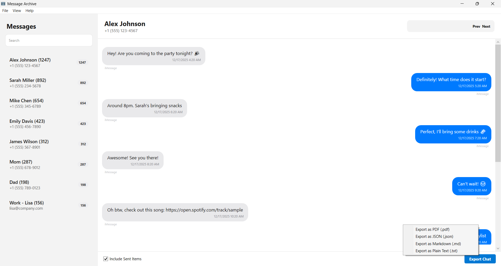

# Message Archive

Message Archive is a Windows desktop application for viewing and exploring iMessage conversations from local iPhone backups. It allows you to read iMessage message history on a PC, search conversations, and export message data without uploading anything to the cloud.

## Privacy & Data Cleanup

For maximum speed, Message Archive creates a local index database named `vault.db`. This file remains on your computer after you close the application so that your conversations load instantly the next time you use it.

**If you wish to remove all indexed data from your computer, simply delete this folder after use:**  
`%LOCALAPPDATA%\MessageArchive`

To do this, press `Win + R`, paste the path above, and delete the folder.

## Download

**[Download the latest Windows installer](../../releases/latest/download/MessageArchive-Setup.exe)**
or **Download from the Microsoft Store (https://apps.microsoft.com/detail/9ppcz3wmxvdn?hl=en-US&gl=US)**

## Features

- **Browse iMessage Conversations**  
  View all iMessage conversations organized by contact

- **Complete Message History**  
  Read full iMessage threads with timestamps

- **Link Extraction**  
  Automatically collects shared links (YouTube, Instagram, Spotify, and more)

- **Conversation Statistics**  
  View local statistics such as message counts, word frequency, and emoji usage

- **Search**  
  Find specific messages across all conversations

- **Export Options**  
  Export conversations as PDF, Markdown, JSON, or plain text files

## Data Handling

Message Archive operates entirely on files stored on your computer. iMessage data is read from user-selected local iPhone backups and is not modified. The application does not transmit data or connect to external services during normal operation.

## Requirements

- Windows 10 or Windows 11 (64-bit)
- An **unencrypted** iPhone backup created using iTunes or the Apple Devices app

## How to Create an iPhone Backup on Windows

1. Connect your iPhone to your PC using a USB cable
2. Open **iTunes** or the **Apple Devices** app
3. Select your device
4. Choose **This Computer** (not iCloud)
5. Make sure **Encrypt local backup** is **not enabled**
6. Click **Back Up Now** and wait for the backup to complete

## License

This project is licensed under the MIT License. See the [LICENSE](LICENSE) file for details.

**Trademark Notice**  
iMessage and iPhone are trademarks of Apple Inc. This application is not affiliated with, endorsed by, or sponsored by Apple.

## Support

If you encounter an issue, you can open a GitHub issue or contact:

**support.messagearchive@proton.me**

If you find this tool useful, consider starring the repository.
